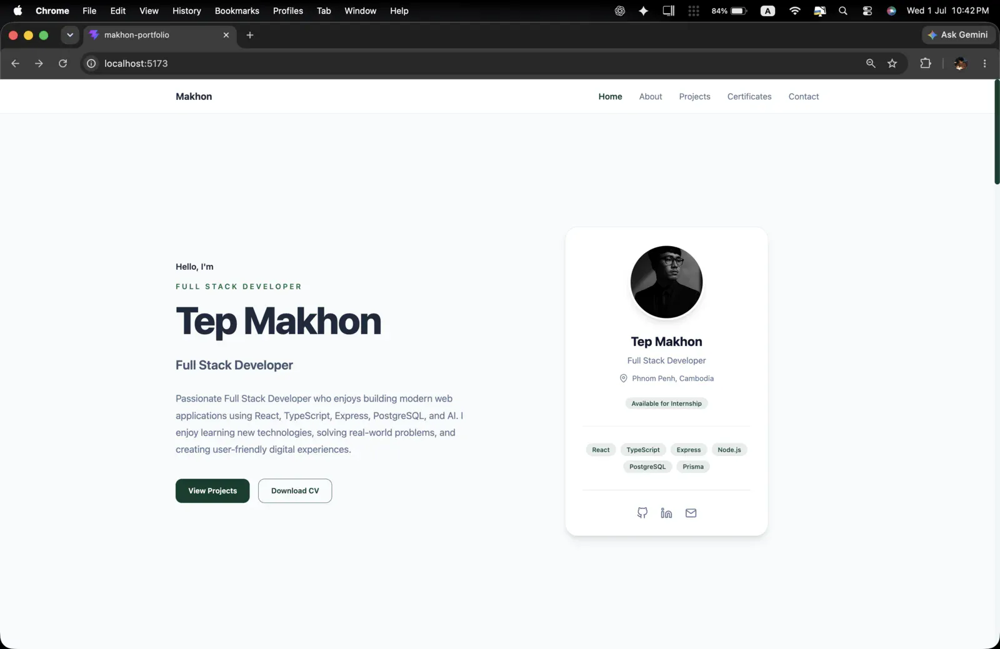
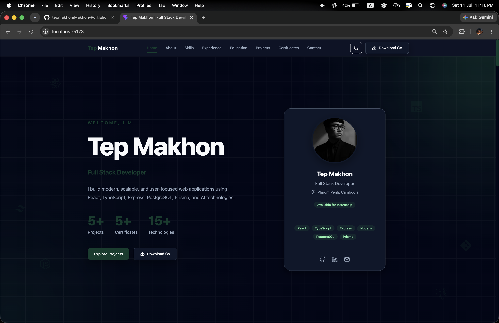
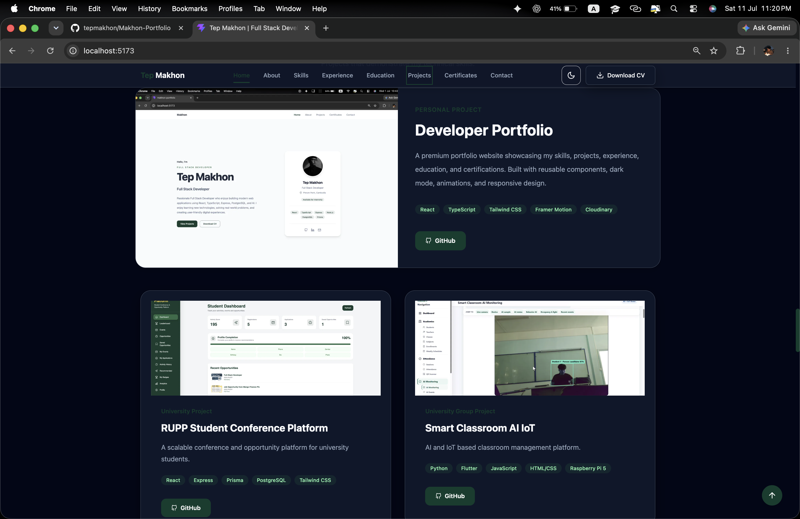
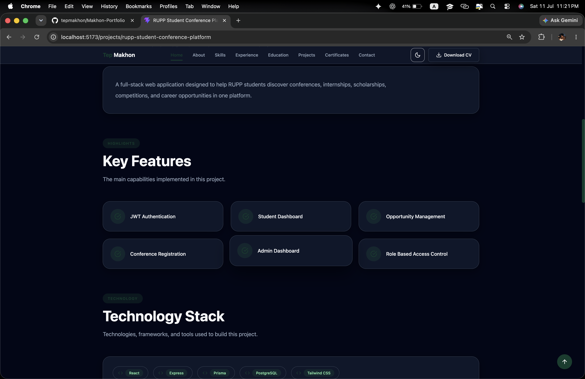
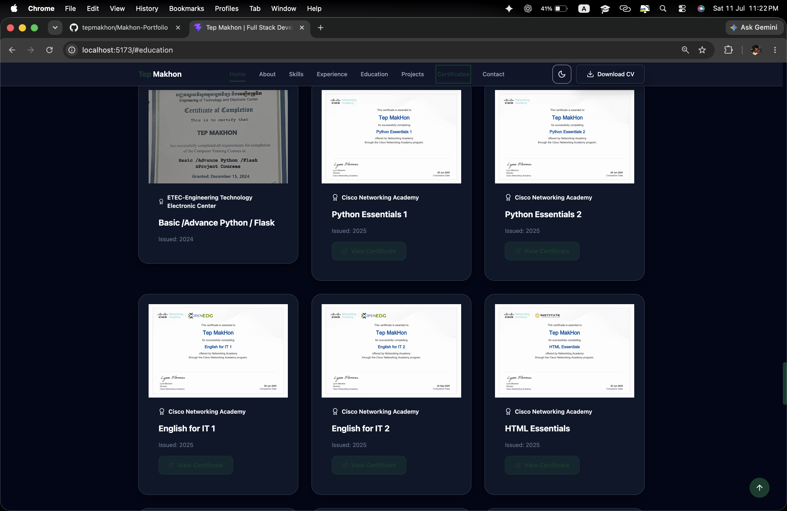
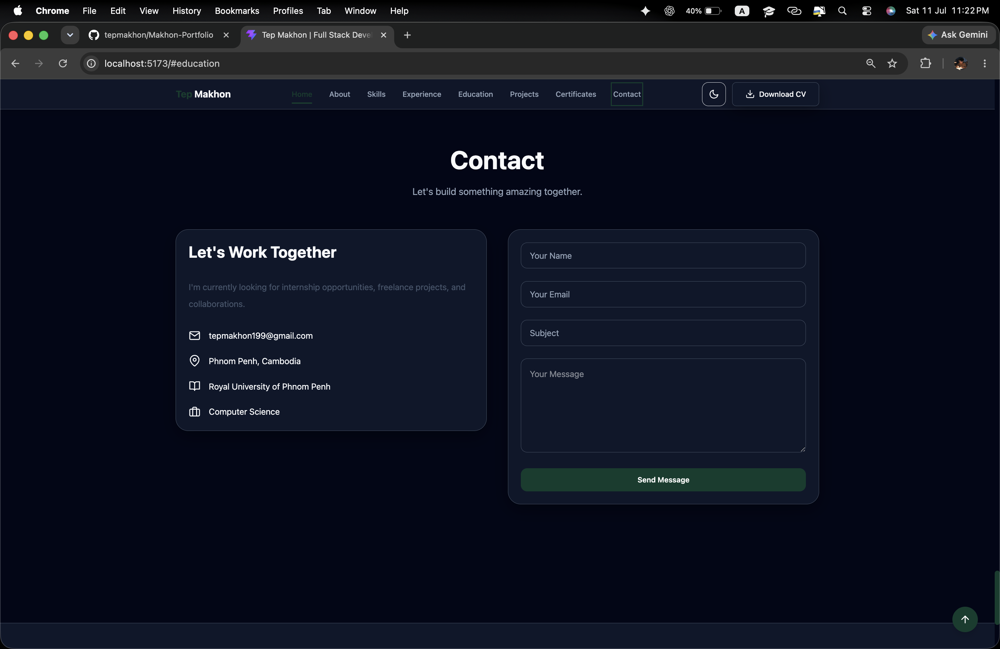

# 💼 Tep Makhon Portfolio

A modern, responsive, and high-performance developer portfolio built with React, TypeScript, Vite, and Tailwind CSS to showcase my projects, technical skills, certifications, and experience.




---

## 🌐 Live Demo

> https://tepmakhon-portfolio.vercel.app

## 📷 Screenshots

### Home



### Projects



### Project Detail




### Certificates



### Contact


---

## ✨ Features

- Responsive design for desktop, tablet, and mobile
- Light & Dark mode
- Smooth animations with Framer Motion
- Project showcase with detailed project pages
- Certificate gallery
- Professional experience & education timeline
- Downloadable CV
- Contact section
- SEO optimized
- Accessibility focused
- High Lighthouse score

---

## 🚀 Tech Stack

### Frontend

- React 19
- TypeScript
- Vite
- Tailwind CSS 4

### UI & Animation

- Framer Motion
- React Icons
- CSS Variables

### Routing

- React Router DOM

### Email

- EmailJS

### Deployment

- Vercel

---

## 📷 Screenshots

### Home

> Add screenshot here

### Projects

> Add screenshot here

### Certificates

> Add screenshot here

### Contact

> Add screenshot here

---

## 📁 Project Structure

```
src
│
├── assets
├── components
│   ├── common
│   ├── layout
│   └── ui
│
├── features
│   ├── hero
│   ├── about
│   ├── skills
│   ├── education
│   ├── projects
│   ├── certificates
│   └── contact
│
├── hooks
├── pages
├── routes
├── data
├── styles
├── types
├── context
└── utils
```

---

## ⚙️ Installation

Clone the repository

```bash
git clone https://github.com/tepmakhon/Makhon-Portfolio.git
```

Go to the project

```bash
cd Makhon-Portfolio
```

Install dependencies

```bash
npm install
```

Run development server

```bash
npm run dev
```

Build production

```bash
npm run build
```

Preview production build

```bash
npm run preview
```

---

## 📊 Lighthouse

| Category | Score |
|----------|------:|
| Performance | 96 |
| Accessibility | 96 |
| Best Practices | 100 |
| SEO | 100 |

---

## 🎯 Project Goals

This portfolio was designed to:

- Showcase my technical skills
- Present my software projects
- Highlight certifications and education
- Provide recruiters with an overview of my experience
- Demonstrate clean architecture and modern frontend development practices

---

## 📂 Featured Projects

### Developer Portfolio

Modern responsive portfolio built with React and TypeScript.

### RUPP Student Conference & Opportunity Platform

A scalable university platform for conferences, internships, scholarships, competitions, and career opportunities.

### Smart Classroom AI IoT

AI-powered classroom management system integrating QR attendance, face recognition, Flutter, and Raspberry Pi.

---

## 📜 Certifications

- Python Essentials 1
- Python Essentials 2
- HTML Essentials
- CSS Essentials
- JavaScript Essentials 1
- JavaScript Essentials 2
- English for IT 1
- English for IT 2
- English for Business & Entrepreneurship
- Python & Flask Training

---

## 👨‍💻 About Me

I'm **Tep Makhon**, a Year 3 Computer Science student at the Royal University of Phnom Penh.

I'm passionate about building scalable full-stack web applications using modern technologies and continuously improving my software engineering skills.

---

## 📫 Contact

Email

```
tepmakhon199@gmail.com
```

LinkedIn

https://www.linkedin.com/in/tep-makhon-542ab836b/

GitHub

https://github.com/tepmakhon

---

## ⭐ Support

If you like this project, consider giving it a ⭐ on GitHub.

---

## 📄 License

This project is licensed under the MIT License.