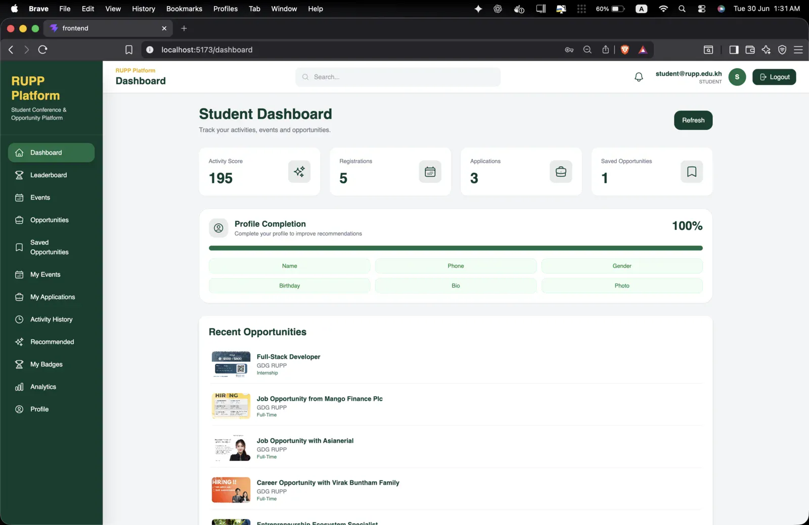
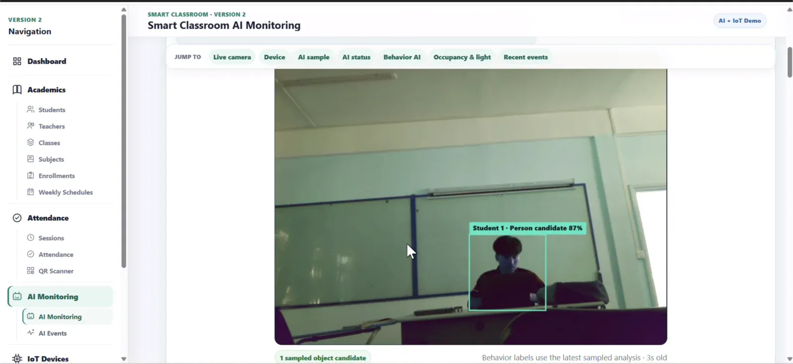

# Tep Makhon — Developer Portfolio

A personal portfolio for a fourth-year Computer Science student at the Royal University of Phnom Penh, Cambodia. It presents three documented software projects, ten learning certificates, education, project experience, a CV download, and contact options.

[Live portfolio](https://tepmakhon-portfolio.vercel.app) · [GitHub](https://github.com/tepmakhon) · [LinkedIn](https://www.linkedin.com/in/tep-makhon-542ab836b/)

## Features

- Responsive layouts and persistent light/dark themes, including system-theme changes.
- RUPP Student Conference & Opportunity Platform featured first, followed by Smart Classroom AI IoT and this portfolio.
- Project detail pages with purpose, responsibility context, architecture, implementation features, and screenshots.
- Keyboard-accessible native dialogs for the mobile menu, project screenshots, and certificate images.
- Labeled contact fields, native validation, submission locking, inline feedback, and direct email fallback when EmailJS is not configured.
- Static HTML for every indexable route, unique metadata, absolute canonical/social URLs, structured data, and a generated sitemap.
- Lazy client routes, existing WebP images, below-the-fold lazy loading, and reduced-motion support.
- Static 404 page with noindex metadata and real 404 behavior on Vercel.

## Existing project images

These are the repository's original project assets, not newly captured screenshots of the upgraded UI. Refresh `public/screenshots/` after visually checking the new build.




## Stack

React 19, TypeScript 6, Vite 8, Tailwind CSS 4, React Router 7, Framer Motion, React Icons, react-helmet-async 3, and EmailJS. npm uses the existing `package-lock.json`. No dependencies were added for the upgrade.

## Development

Use Node.js 22.12+ or a supported newer Node.js release (the upgrade was checked with Node.js 24).

```sh
npm ci
cp .env.example .env
npm run dev
```

EmailJS is optional. Set these browser-safe identifiers in `.env` locally and in Vercel's environment settings:

```dotenv
VITE_EMAIL_SERVICE_ID=your_service_id
VITE_EMAIL_TEMPLATE_ID=your_template_id
VITE_EMAIL_PUBLIC_KEY=your_public_key
```

The template receives `name`, `email`, `reply_to`, `subject`, and `message`. Set its recipient to your own email address and its Reply-To to `{{reply_to}}`. Restrict allowed origins in EmailJS to your production site and any development/preview origins you actually use. Keep private API keys out of all `VITE_*` variables: Vite embeds these values in browser assets. Configure provider-side abuse controls; browser submission limits alone are not a security boundary.

Without all three identifiers, the page shows a direct email action instead of an unusable form. Identifier presence does not prove service delivery or template correctness.

## Build and checks

```sh
npm run lint
npm run build
npm run check:site
npm run preview
```

The build runs TypeScript checks, generates client assets, builds a temporary server renderer in `dist-ssr/`, and prerenders four indexable pages plus `404.html` into `dist/`. Deploy only `dist/`; the server bundle is a build tool, not a production server. Keep `src/data/site.ts` as the authoritative production origin.

`check:site` checks generated HTML, one H1 per page, unique titles, descriptions, canonicals, social metadata, JSON-LD syntax, local asset existence, image attributes, internal links, nested interactive elements, sitemap URLs, robots.txt, the CV PDF header, and unknown-project noindex behavior. It is not a browser, accessibility, or Lighthouse audit.

For a bundle report, use `ANALYZE=1 npm run build`. The report remains a local diagnostic; do not publish it as an application page.

Before deployment, inspect the preview at 375px, 768px, and 1440px in both themes, including 200% zoom and reduced motion. Check menu Escape/focus return, screenshot dialogs, certificate verification, all project links, direct route refresh, and the CV. Verify invalid input, loading, failure, and one successful EmailJS delivery using your own test message. No test email was sent during the upgrade.

No Lighthouse scores or real-user Core Web Vitals are claimed. Browser hydration, visual responsiveness, and external link availability still require verification in a browser.

## SEO and hosting

For worldwide discovery, Google/Bing ownership verification, sitemap submission, and consistent profile links, follow [the search discovery guide](docs/search-discovery.md). The owner-provided Google ownership token is configured in `src/data/site.ts`. `VITE_GOOGLE_SITE_VERIFICATION` can override it, and optional `VITE_BING_SITE_VERIFICATION` enables Bing verification. These values contain only public verification tokens; rebuild and redeploy after changing them.

`src/entry-server.tsx` renders the same route tree as the client. Helmet 3 uses React 19 native metadata; the build moves rendered metadata into the document head. Content is visible in the HTML before JavaScript. `scripts/prerender.mjs` derives sitemap routes from the project data, uses one origin, and generates robots.txt. The homepage describes the visible identity with Person and WebSite JSON-LD. Unknown routes are excluded from the sitemap and have noindex metadata.

`vercel.json` uses clean URLs for the generated project HTML, removes trailing slashes, serves the static 404 page, and applies immutable caching only to hashed assets. It does not rewrite every URL to the homepage.

To deploy:

1. Import this GitHub repository into Vercel, or use its existing Vercel project.
2. Confirm the production domain is `tepmakhon-portfolio.vercel.app`. If it changes, update `src/data/site.ts` and the public robots/sitemap origin and rebuild.
3. Set the EmailJS identifiers if the form is desired. Use build command `npm run build` and output directory `dist`.
4. Deploy a preview, perform the browser checks above, then promote the reviewed deployment to production.
5. Verify `/`, all three `/projects/:slug` URLs, `/robots.txt`, `/sitemap.xml`, `/resume.pdf`, and an unknown route. Confirm HTTP 404 for the unknown route and page-specific source metadata for real routes.
6. Add a Google Search Console URL-prefix property for `https://tepmakhon-portfolio.vercel.app/` and complete its ownership-verification method. If using an HTML verification file, place it in `public/` and redeploy.
7. Submit `sitemap.xml` in Search Console. Inspect the homepage and each project URL, run the live URL test, and request indexing after verification. Monitor Page Indexing and Core Web Vitals as data becomes available; indexing and search enhancements are not guaranteed.

## Structure

```text
src/
  assets/              Original portraits, screenshots, and certificate images
  components/          Shared layout, controls, metadata, and dialogs
  context/             Theme state
  data/                Profile, projects, case studies, skills, and site origin
  features/            Homepage sections and project details
  hooks/               Navigation and contact state
  pages/               Home, ProjectDetail, and NotFound
  routes/              Shared client/server route tree
  services/            EmailJS integration
  styles/              Shared theme and layout tokens
  entry-server.tsx     Build-time renderer
  main.tsx             Client mounting/hydration
scripts/               Prerender generation and static-output checks
public/                CV, social preview image, favicon, and theme initialization
docs/                  Upgrade audit and verification record
vercel.json            Static hosting configuration
```

Reference: [Vite server-side rendering](https://vite.dev/guide/ssr.html) and [Vercel project configuration](https://vercel.com/docs/project-configuration).

## Content to confirm

The student year was updated from the user's brief. Internship availability and existing project/training dates were retained. SmartRoadmap is omitted because this repository contains no description, screenshot, or verified links for it. Smart Classroom remains explicitly identified as a group project; individual contributions, production usage, measured outcomes, and personal challenge stories were not invented. Review the existing CV and provide a higher-resolution portrait and current screenshots when available.
